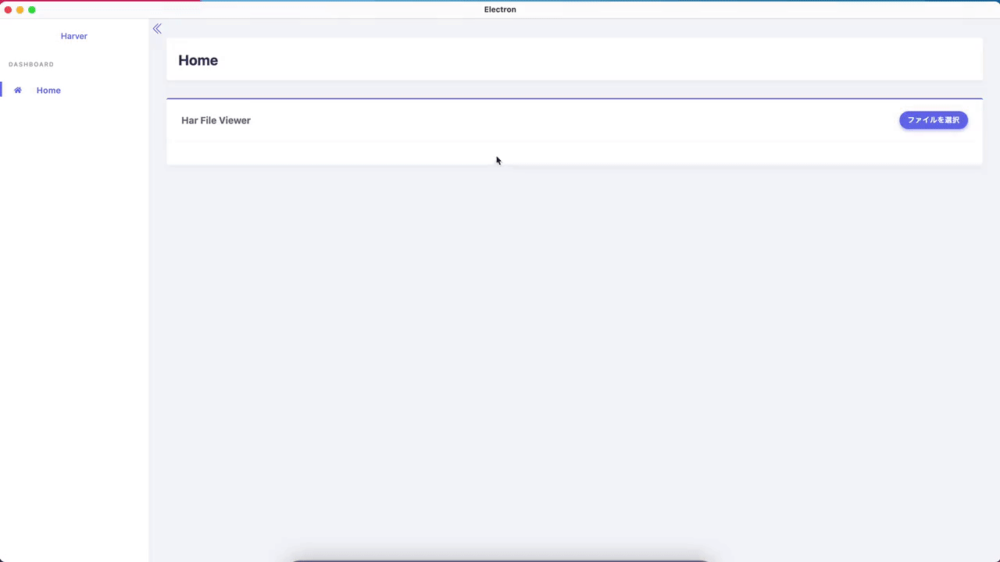

# Develop HTTP Archive File Viewer by Electron.

## Now 👨‍💻

## Stack 🌏

- Electron
    - Main Process
        - Webpack
            - Prettier
            - Babel
                - ESLint
    - Renderer Process
        - React
        - MobX
        - GatsbyJS
            - Prettier
            - Babel
                - ESLint

Sorry, Now Developing.😢

## Thank you 🙇‍♂️

- [Electron](https://www.electronjs.org/)
- [React](https://ja.reactjs.org/)
- [MobX](https://mobx.js.org/README.html)
- [GatsbyJS](https://www.gatsbyjs.org/)
- [webpack](https://webpack.js.org/)
- [Babel](https://babeljs.io/)
- [ESLint](https://eslint.org/)
- [Prettier](https://prettier.io/)
- [Bootstrap](https://getbootstrap.com/)
- [React Bootstrap](https://react-bootstrap.github.io/)
- [Stisla](https://getstisla.com/)

## License

